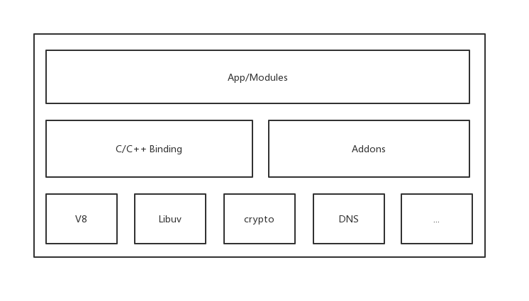
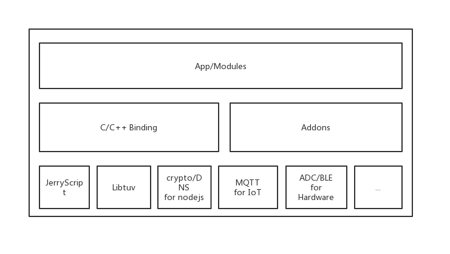

# JavaScript in IoT

今天分享的内容是 “JavaScript in IoT”，在低端设备上运行 JavaScript，这与我上一段工作经历有关，之前我在一家做语音交互和 IoT 的公司，负责 IoT 设备端服务的基础架构，简单来说就是运行在 IoT 设备上的一个服务，与 IoT 云端交互用的。当时我用的 IoT 设备主要是几款智能音箱，上面有搭载有嵌入式开发板，系统资源的话内存基本都在100MB 左右，这相对我们日常开发用的电脑或服务器来说可以算是捉襟见肘的，我负责的内容就是用 js 语言在这个板子上面做一个与云端交互的模块，那这种低端设备上如果运行日常用的 Node.js 肯定是跑不动的，所以我们为了实现在 IoT 设备运行 js 并用 js 写程序，特地开发了一套针对 IoT 场景的 js 运行时，叫 ShadowNode。
对我来说最开始的时候我只是这个项目里面的一个贡献者，后面跟团队接触多了，也就逐渐地被吸引以至于最后直接加入团队，后面就用这个工具进行 IoT 的研发，慢慢地也对整个体系有了更多的了解。

## IoT

> The Internet of Things (IoT) is a system of interrelated computing devices, mechanical and digital machines, objects, animals or people that are provided with unique identifiers (UIDs) and the ability to transfer data over a network without requiring human-to-human or human-to-computer interaction

什么是 IoT， 全称 Internet of things，也就是物联网。
这是 wiki 上对 IoT 的解释，IoT 是一种由具有唯一 id 的计算设备、机械、数字设备、物体、动物或人等关联起来的系统，并且可以通过网络传输数据，无需人与人或人与计算机交互，也就是所谓的万物互联。但目前为止我们日常所碰到的 IoT 设备见得比较多的还是各种灯、音响，比如米家有各种设备可以连入网络，我们之前就有自研的智能音箱，可以连接各种三方设备，并可以通过语音或手机控制。

## 为什么是 JavaScript

首先对于程序员，肯定要考虑如何对 IoT 进行编程，或者说在嵌入式设备上写程序，我们可能比较了解的是用 c 或 C++ 语言进行编程 ，因为 IoT 设备中充斥着大量低端设备，这里说的低端设备指的是比如各种嵌入式芯片，RAM 或 ROM 或 flash 容量非常小，我们所知道的树莓派已经算是很高端的设备了，通常内存都在2G 以上，比如我们以前用的智能音箱上的内存基本都在100M左右，因此在这种设备上写程序，c/c++ 基本是标配。

但我们今天要讲的是用 JavaScript 在这种低端设备上编程。大家可能觉得我们疯了，因为都知道JavaScript是一种脚本语言，一直以来主要在前端里面用，后来被引用至服务器端也就是 Node.js。当时对我们来说最现实的需求就是，最开始我们的 IoT 服务都是用 js 写的，而且运行在比较高端的设备上，后来引入低端设备的时候发现如果不做底层的优化，那所有的业务都得重写。JavaScript作为一种脚本语言是解释执行的，其性能堪忧，而且也不是世界上最好的语言，但我们也知道，JavaScript拥有非常完善的社区生态和庞大的开发者群体，这是一个非常大的优势，其实用 C/C++ 编程相对来说门槛还是挺高的，但试想一下，如果一个前端开发者，只会 js 语言，原本只会写前端页面，但是现在能在简单学习了 IoT 设备相关 api 后就能动手开发嵌入式程序，想想是不是很酷，其实这也是我们的初衷，也就是利用 js 的生态和社区基础，降低嵌入式开发的门槛并助推推广 IoT 的发展。至于性能什么的，这是我们需要考虑的！

而且我们也确实在低端设备上去运行 js 了，那我们是怎么做到的呢？

## Node.js

讲到JavaScript，必然要提到 Node.js，而且今天的主要内容也会跟 Node.js 有关。我们知道 Node.js 是在服务器端运行JavaScript的环境，类似于虚拟机。

V8/libuv是构成 Node.js 的两大核心组件，V8 原本是chrome 的 js 引擎，后来被引用到 Node.js 中，为 js 语言提供了解析和运行的环境，libuv 则是我们常说的 Node.js 异步非阻塞的来源，这里面也用到了很多系统级的api和资源。还有一些三方库用来为系统提供一些功能，比如openssl，crypto、zlib等等。

同样，在嵌入式设备上运行也可以采取类似的架构，因为本身也都是linux，比如需要一个可以在低端设备上运行的 js 解释和执行环境，然后也需要一些额外的支持用来提供异步i/o以及各种上面提到的加解密、网络通信等等操作

后来我们就找到了 JerryScript

## JerryScript

> JerryScript is the lightweight JavaScript engine intended to run on a very constrained devices such as microcontrollers: 
>
> • Only few kilobytes of RAM available to the engine (<64 KB RAM) 
>
> • Constrained ROM space for the code of the engine (<200 KB ROM)
>
> The engine supports on-device compilation, execution and provides access to peripherals from JavaScript.

JerryScript 是一款由三星研发的用于 IoT 设备的 js 虚拟机

这是jerry 官网首页的一句话简介：JerryScript 是一个为 IoT 而开发的轻量级 JavaScript 引擎，可以运行在资源十分受限的设备上，支持在设备上解释、执行 JavaScript 以及对外围设备的访问，内存低于64KB，rom低于200KB，可以说对资源很苛刻了。

这个表展示了各种层次的设备的软硬件指标，JerryScript 就是针对下述 Low-end 也就是低端设备开发的。

|                       | **Low-end**      | **Medium-end** | **Smart** **phone** |
| --------------------- | ---------------- | -------------- | ------------------- |
| **RAM** **/** **ROM** | Tens of kb ~ 4MB | Hundreds of MB | GB+                 |
| **Processor**         | 1 Core           | 1 – 4 Core     | 4 Core+             |
| **OS**                | RTOS             | Linux          | Android / iOS       |

JerryScript 也可以看作是对 EcmaScript 标准的一个实现，目前支持到 es5的标准

Jerry 之所以能在低端设备上运行，因为其采用了非常紧凑的内存布局设计，对源码解释、运行过程、对象属性、值表示以及函数操作都做了针对节省内存的优化

比如：v8里面对 js 源码的解析会经过源码 --> ast（抽象语法树）--> 字节码，而 jerry 直接把 ast 那一步省略了，直接从源码解释成字节码。另外jerry还对字节码快照进行了优化，可以直接执行快照，甚至可以把快照存到rom里并直接从 rom 里执行快照，这样节省了源码解析的内存消耗与性能成本。

另外 jerry 对各种类型和值表示的内存布局也设计得相当紧凑，这极大地节省了内存，当然，极致的优化也会带来一些副作用，比如代码的执行效率会降低。

具体的就先不展开了，感兴趣的话大家可以去jerry官网看，感兴趣的同学也可以把源码 down 下来，本地编译一下，或者也可以按照文档的说明用这个引擎把你的 js 代码嵌到 C 代码里运行，不过直接在 mac 上编译会碰到一些问题，在此我也准备了一个 docker 容器，我在里面已经准备好了所有编译 Jerry 所需的环境，并发布到了公共的 docker hub，感兴趣的同学可以 pull 下来试一试。

## IoT.js

前面说了，只有一个 js 环境并不能搞定一切，一个裸的 js 虚拟机还是太局限了，因此还需要一些额外的支持来提供完善的环境，幸好三星也同样做了这样的支持。为此三星还开发出了 Libtuv。

Libtuv，是对标 Node.js 所用的 libuv 的嵌入式版本，也是三星开发，为整个运行的环境中提供异步I/O的能力。而 IoT.js，就是一个完整的能在嵌入式设备上运行的 js 运行时， Node.js 支持的特性它也基本支持，比如异步I/O，事件循环，以及各种原生的api。

其实整个架构体系和我们刚刚看到的 Node.js 是差不多的，只不过底层支撑的模块不一样，同时，为了能更好地运行在 IoT 环境里，IoT.js 也根据嵌入式设备的场景做了一些额外的支持，比如 mqtt，还有一些对嵌入式设备的操作支持。

讲到这里，好像没什么事可做了，因为三星已经把该做的都做了，IoT.js 做的支持也足够，什么异步 i/o， IoT 适配都做了，对内存的优化也做到了几十k的变态级别，但这真的就是我们想要的吗？

我们看看 IoT.js 有什么问题？

为了把内存控制在几十k的级别，IoT.js 可谓是费尽心机，这也导致了 IoT.js 不支持很多好用的特性，比如不支持类，promise，甚至不支持 debug，出错的时候无法输出完整的错误栈，这就很头疼了。不过，当时我们业务上用的设备也没那么苛刻，基本都是内存在 100MB 左右的中端设备，而且也为了顺应社区和生态的需求，我们也希望我们用的运行时能支持更多的特性，也能更加容易使用，所以我们就在 IoT.js 的基础上开发了 ShadowNode。

## ShadowNode

ShadowNode 是基于 IoT.js 一个运行时，只不过面向的目标设备不一样，IoT.js 面向极低端的设备，而 ShadowNode 则是面向中端设备，因此两者并不冲突。我们当时的工作主要有几个，一个是对于一些实用特性的支持，比如错误栈、更完善的 js 语言特性等，还有一个就是支持更多的 Node.js api 以及社区的构建。

## ShadowNode 的原生支持

目前 ShadowNode 原生支持的特性有 Class，Promise，以及 debug 的错误栈输出，N-API等等，以及更完善的兼容 Node.js 的 api，不过目前一些特性在 JerryScript 中也逐渐被支持了，生态总是越来越完善。

## mqtt & dbus

mqtt 其实是一个面向 IoT 场景的通信协议，基于 TCP，同样的，协议的设计也十分精简和“节约”，有点类似于我们平常在做 TCP 通信的时候自己定义的封包规则，只不过里面还定义了很多校验数据的规则，总体来说也是为 IoT  特殊场景而优化的。至于 D-Bus，可能做过 Linux 开发的同学会更加熟悉，这是一种高效的 IPC 机制，感兴趣的同学可以自行查阅资料。

## 支持的平台

目前 ShadowNode 支持以下平台：

* Linux / (Docker)
* MacOS
* Raspberry Pi
* Kamino18 / (Amlogic/a113) / Hi3561
* NuttX / TizenRT

ShadowNode 在 Linux 和 MacOS 中能被友好地支持（不过在 mac 上编译会碰到一些问题，比如 dbus，可以参考 issues 解决），目前 windows 还不支持。感兴趣的同学也可以尝试在 docker 容器中试着编译运行，我之前尝试过，也碰到过一些问题。Raspberry Pi 也是支持的，不过大多数树莓派属于高端设备了，使用 ShadowNode 的意义并不大。Kamino18 / (Amlogic/a113) / Hi3561 是我之前在工作中用到过的三款开发板，其中 Kamino18 是rokid 自研的，Amlogic/a113 是晶晨半导体的，Hi3561来自华为海思。至于 NuttX / TizenRT，其实我也不太懂，是 ShadowNode 主页看来的，貌似是两款 rtos，感兴趣的同学可以自行搜索相关资料。

## NPM

目前对于 ShadowNode 来说，原生的 npm 还不支持，其实支持起来是不难的，而且我们当时的期望是兼容整个 Node.js 体系的，只不过这里面有一些现实原因，比如兼容性、性能等等，这也是我一直认为比较遗憾的地方。

我们在系统定义了一个全局的 node_modules，使运行时默认寻址，这样就能减少包导入的消耗。因为我们还是希望以此去推动社区发展的，并也希望能通过社区助力整个生态的成长，因此包管理机制怎么也得有一个，目前完全开放的 npm 使得任何人都可以随时写一个 Node.js 包发到 npm 平台上，这也就会造成包管理混乱、代码质量不可控等问题。我当时所设想的是一种半私有的包管理机制，在兼容 Node.js 端和设备端的同时，鼓励开发者把现有的 Node.js 包改造成能在设备上良好运行的样子，而且可以发到我们的平台上，当然，我们会加强审核，比如需要通过我们的性能测试以及代码 review。

## 硬件接口

ShadowNode 也同样支持一些硬件接口，比如 ADC/BLE 等等，这个的话有兴趣的同学可以自行看资料。

## 社区和商业化

有了工具，必然是要做一些事情的，除了当时我负责的 IoT 设备端服务外，我们还基于 js 和 Linux 打造了一款面向 IoT、智能设备以及语音交互的操作系统 YodaOS，并定义了一套语音交互应用开发的范式VUI和标准，而且后面我们也期望开发我们自己的 js rtos -- rt-node，关于这些内容这里就不再做详细介绍了，原因的话一方面这几块内容我并没有直接参与，所以对里面一些细节也不很了解，另一方面 YodaOS 相关的内容与当时公司的业务太紧密相关，而且也区分商业版和社区版，所以这里也不适合详细介绍，感兴趣的同学可以自行去搜索相关内容。

相关链接：

[IoT wikipedia](https://en.wikipedia.org/wiki/Internet_of_things)

[JerryScript](https://jerryscript.net/)

[JerryScript GitHub](https://github.com/jerryscript-project/jerryscript)

[JerryScript Env by Docker](https://hub.docker.com/r/txiaozhe/jerry-builder)

[IoT.js](http://www.iotjs.net/)

[IoT.js GitHub](https://github.com/jerryscript-project/iotjs)

[ShadowNode GitHub](https://github.com/yodaos-project/ShadowNode)

[YodaOS GitHub](https://github.com/yodaos-project/yodaos)

[yoda.js GitHub](https://github.com/yodaos-project/yoda.js)

[rt-node GitHub](https://github.com/yodaos-project/rt-node)

Thanks :) @eshine @yorkie @lolbig